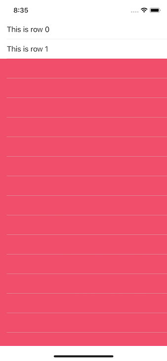
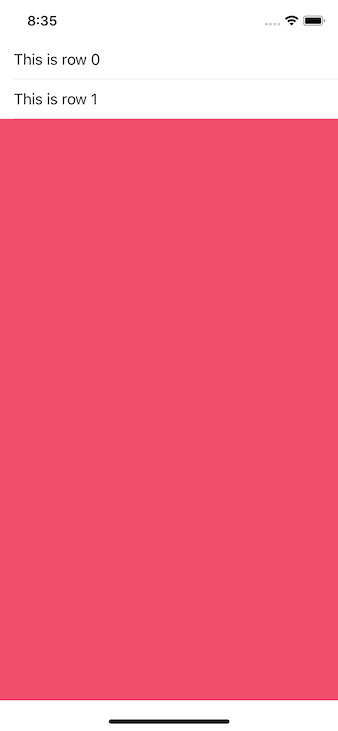

# ios-tricks
The purpose of this repository is to register (mostly for myself) tips and tricks for commum problems that I've faced as an iOS developer.

# UIScrollView

# UITableView separator
This tip is for those who want a separator line between cells of a `UITableView`, but do not want it when the tableView has only a few cells. If you define a `single line` (or event a `default`) separator for your `UITableView`, this is how it will looks like when it has only two cells:



Well, there will be times when you just want the separator not to show up when there is no cell (row). Some may find the solution is to create `separator cells`, and let the default separator style of the `UITableView` as `none`. There is a simplest solution, though.

Just defining the `tableFooterView` property of your `UITableView` is enough to do the job:

```swift
tableView.tableFooterView = UIView(frame: .zero)
```

Now your tableView should look like this:


# NavigationController background color


