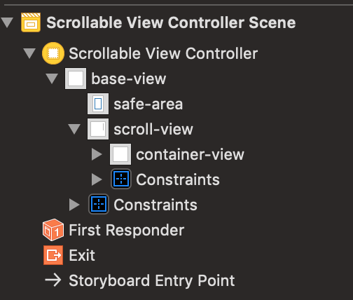
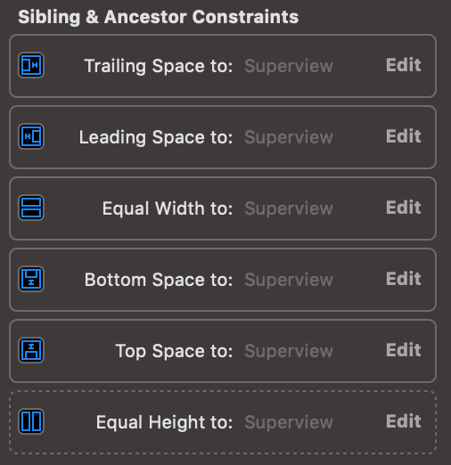
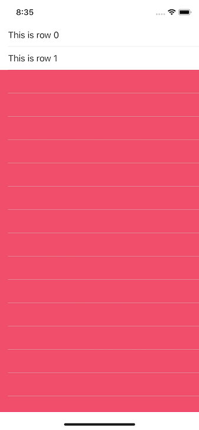
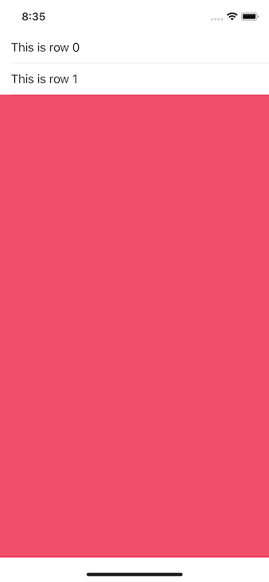

# ios-tricks
The purpose of this repository is to register (especially for myself) tips and tricks for commum problems that I've faced as an iOS developer.

# UIScrollView
Scroll view's can be really annoying. Sometimes you just want to add some additional elements to one scroll view that already exists, but it ends up breaking your entire layout.

Something that I've learnt is using a container view that fills the whole body of the parent view (in this case, the scroll view). With the right constraints, this is only you have to do in order to add UI elements and constraints as you would do with common views.

The "base" structure of the views should look like this:



All UI elements will be placed in the `container-view`. `scroll-view` should have "regular" constraints (`leading, trailing, top and bottom`) to it's parent (`safe-area`). The constraints defined for `container-view` are:



Notice that, besides having the "regular" constraints to it's parent, `container-view` also defines two additional constraints: `equals width` and `equals height` to `scroll-view`. This is important and it is what will make the content scrolling when necessary. However, to not generate any constraints conflicts in runtime, the `equals height` constraint must have a very low priority, such as `250`.

That's it! The elements can now be placed on the `container-view` as usual. To make the content scroll when it exceeds the screen height dimensions, you should place a `bottom space` constraint of the last element to it's super view, in this case, the `container-view`. The sample can be found in `[src](/scr/iOSTips)` folder.


# UITableView separator
This tip is for those who want a separator line between cells of a `UITableView`, but do not want it when the tableView has only a few cells. If you define a `single line` (or event a `default`) separator for your `UITableView`, this is how it will looks like when it has only two cells:



Well, there will be times when you just want the separator not to show up when there is no cell (row). Some may find the solution is to create `separator cells`, and let the default separator style of the `UITableView` as `none`. There is a simplest solution, though.

Just defining the [`tableFooterView`](https://developer.apple.com/documentation/uikit/uitableview/1614976-tablefooterview) property of your `UITableView` is enough to do the job:

```swift
tableView.tableFooterView = UIView(frame: .zero)
```

Now your tableView should look like this:



# NavigationController background color

# Singleton var property

